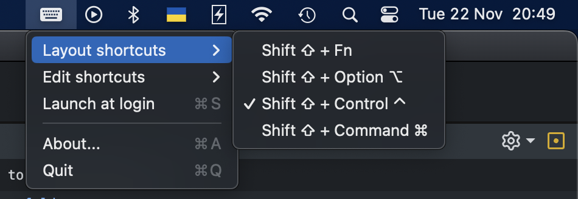

# About
LayoutSwitcher is open-source application that allows you to change keyboard layout using shortcuts that are not alloved by MacOS: Fn + Shift ⇧, Option ⌥ + Shift ⇧, Command ⌘ + Shift ⇧ or Control ⌃ + Shift ⇧. In some sence it an alternative for the Punto Switcher or Karabiner if you are using it for similar purpose, because both are kind of overkill for this.

# Installation
1. Download Intel or M1 image by the link below 
2. Drag'n'drop LayoutSwitcher application from dmg-file to your Applications folder
3. Make sure that you are using MacOs default shortcut (Control ⌃ + Space). You can check that by "Settings -> Keyboard -> Shortcuts". That is needed, because application emulates this shortcut in order to switch keybourd layout.
4. Run the application. You could be asked for provide permissions to run it, since it was downloaded not from the App Store. You can provide permissions by clicking allow button at "Settings -> Security & Privacy -> General"
5. At the first run application will ask you to add LayoutSwitcher to "Settings -> Security & Privacy -> Privacy -> Accessibility" in order to work properly. This is needed to be able globally monitor shortcut that you chosen to switch keyboard layout.
6. Since Mac OS Ventura Apple removed the option “Allow applications downloaded from anywhere” from the system settings. You can understand that if you will see "Application can't be opened because Apple cannot check it for malicious software". To fix that you should open Terminal and type `sudo spctl --master-disable`

# Downloads
* GitHub: https://github.com/3t0n/LayoutSwitcher/releases/

# Stand With Ukraine:

